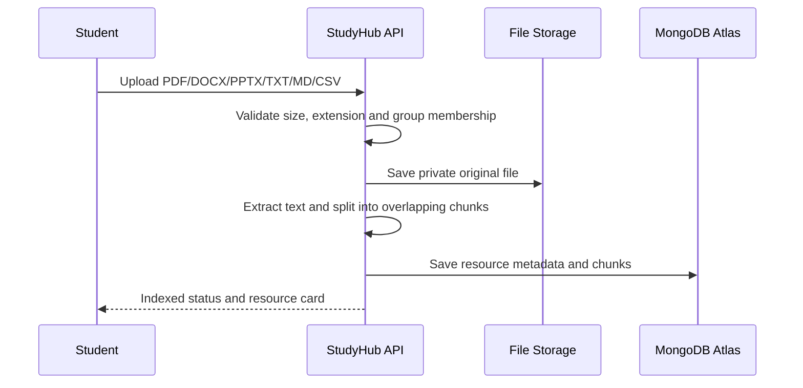
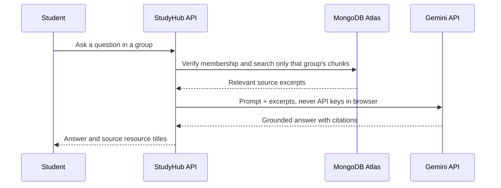

# StudyHub data, storage, and document AI

## Chosen production services

- **MongoDB Atlas** stores accounts, group membership, resources, assignments, discussions, activity and extracted document chunks.
-- **S3 (recommended) or local storage** holds original user files in a private bucket or folder. The browser never receives service credentials; the API creates short-lived signed download links only after it checks group membership.
- **Gemini API** generates grounded explanations, flashcards, quizzes and study plans from retrieved chunks. It can also receive a small scanned PDF directly if normal text extraction finds no readable text.

## File ingestion path

## Study-answer path

## MongoDB collections

| Collection | Important fields | Purpose |
| --- | --- | --- |
| `users` | `id`, `email`, `passwordHash` | Student identity and sign-in data |
| `groups` | `id`, `ownerId`, `inviteCode` | Collaborative group records |
| `memberships` | `groupId`, `userId`, `role` | Access control boundary |
| `resources` | `groupId`, `storagePath`, `indexStatus` | File metadata and indexing state |
| `resourceChunks` | `groupId`, `resourceId`, `content` | Searchable content supplied to the AI |
| `assignments`, `discussions`, `activity` | `groupId` | Collaborative features |

The server creates a unique email index, a unique group-member index, group resource indexes, and a text index for `resourceChunks` at startup.

## Setup

1. Copy `.env.example` to `.env`.
2. Create a MongoDB Atlas cluster and put its connection string in `MONGODB_URI`.
3. Create an S3 bucket (recommended) or use local storage for development. For S3 set `S3_BUCKET`, `S3_KEY`, `S3_SECRET` (or `AWS_*` equivalents).
4. Add `GEMINI_API_KEY` to enable generated answers. Without it, the application still extracts, searches and returns source-grounded local study material.
5. Run `npm.cmd start`.

For development without cloud credentials, the app deliberately falls back to `data/db.json` and `data/uploads/`; the same endpoints continue to work. Do not use that local fallback for deployment.

## Security rules

-- Keep storage service credentials and the Gemini key only in server environment variables.
- Keep the Storage bucket private; do not expose public document URLs.
- Check membership before every workspace, upload, study, or download request.
- Limit files to 20 MB and allow only document formats that the ingestion pipeline supports.
- Add antivirus scanning, rate limiting, password reset/email verification, audit retention, and backup policies before public deployment.
